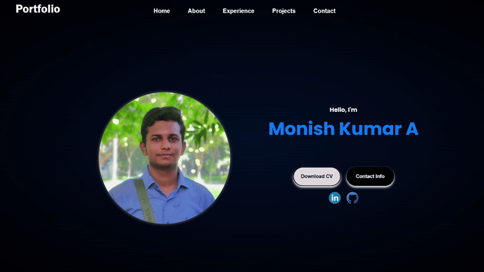
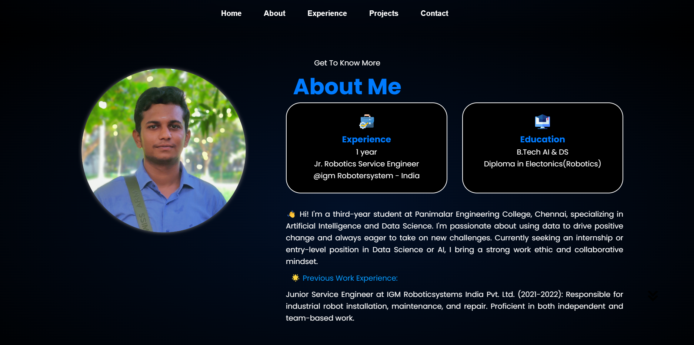
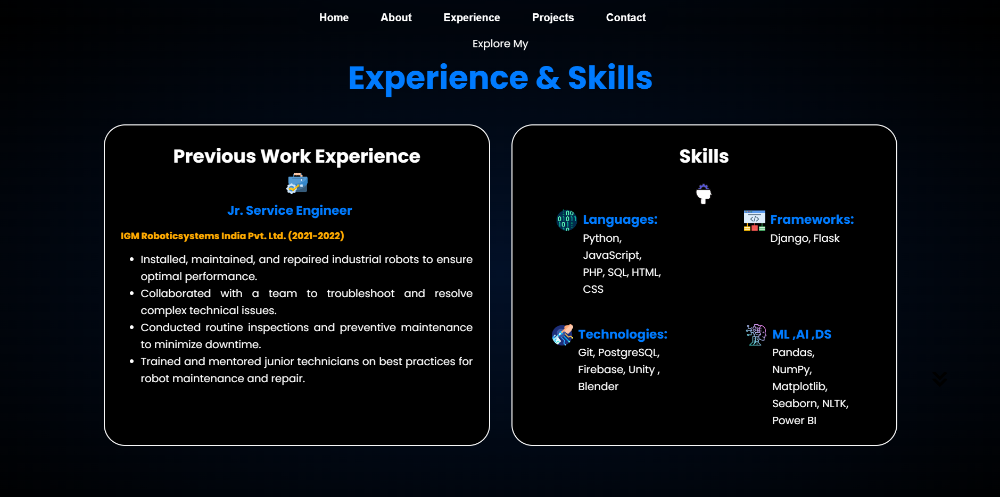
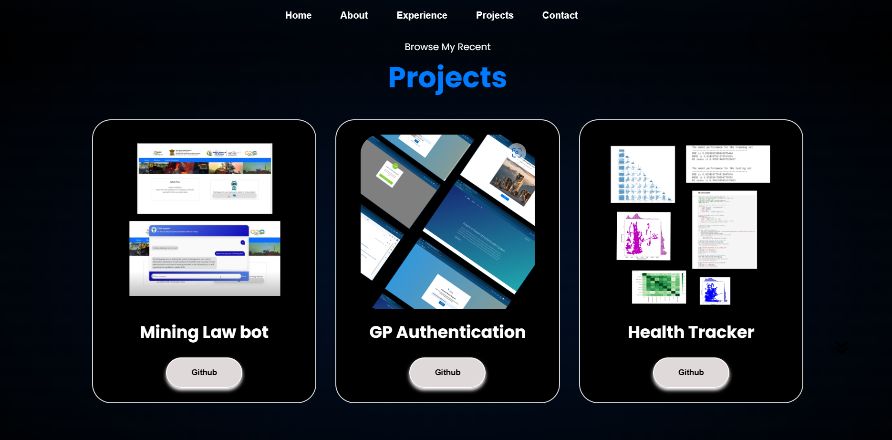

# Personal Portfolio

Welcome to my personal portfolio repository! This repository hosts the code and assets for my visually appealing personal portfolio website. Dive into the code and design to explore my professional journey and achievements.

## 🌟 Features
- **Responsive Design:** Elegant layout optimized for various screen sizes.
- **Sections:** Explore About Me, Experience, Projects, and Contact Information.
- **Dynamic Text Animation:** Engaging animations showcasing my skills and roles.
- **External Links:** Connect with me on [LinkedIn](https://www.linkedin.com/in/monish-kumar-a-38777b1b6/) and [GitHub](https://github.com/imonishkumar). Download my [resume](./assets/resume/resume-monish.pdf).
- **Project Showcase:** Detailed project sections with GitHub links.
- **Contact Information:** Easily reach out via [email](mailto:monishkumar.ai@outlook.com) or [LinkedIn](https://www.linkedin.com/in/monish-kumar-a-38777b1b6/).

## 🚀 Usage
1. **Clone the Repository:** `git clone https://github.com/your-username/your-portfolio.git`
2. **Customize Content:** Edit HTML files to reflect your information.
3. **Styling:** Modify CSS files for personalized styles.
4. **Replace Images:** Update profile picture and other images in `assets/img/`.

## 💻 Technologies Used
- HTML5
- CSS3
- JavaScript

## 📁 Project Structure
- `index.html`: Main HTML file defining the portfolio structure.
- `assets/`: Directory for images, stylesheets, and JavaScript.
- `assets/css/`: Stylesheets for the portfolio.
- `assets/js/`: JavaScript for interactive elements.
- `assets/img/`: Image repository.

## 📸 Screenshots

## 🤝 How to Contribute
Found issues or have suggestions? Open an issue or create a pull request. Contributions are welcome!

## 📝 License
This project is licensed under the [MIT License](LICENSE).

## 📬 Contact
Connect with me on [LinkedIn](https://www.linkedin.com/in/monish-kumar-a-38777b1b6/) or [email](mailto:monishkumar.ai@outlook.com). Let's chat!

**Visit my Personal Portfolio [here](https://imonishkumar.github.io).**

Thank you for visiting my portfolio repository! 🚀
